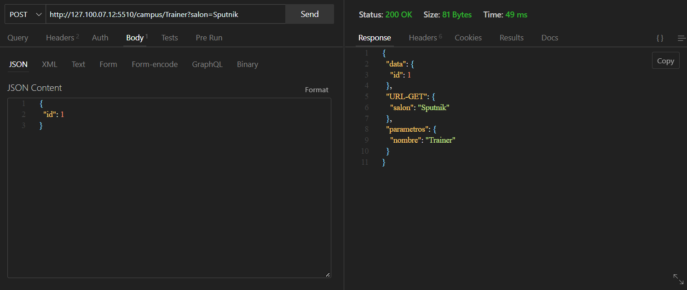
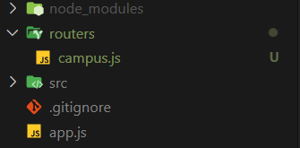
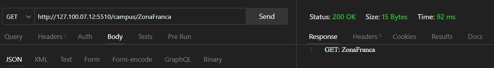
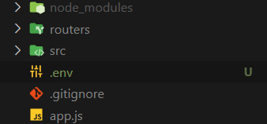
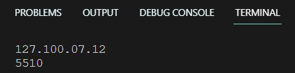
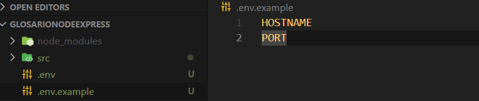

# Express

## Intalacion:
iniciamos el npm : `- npm init -y`
- `npm i -E -D nodemon`
- `npm i -E -D express`

1. el archivo package.json ya debe tener iniciado el nodemon en:
`"dev": "nodemon --quiet ./app.js"`

2. Debes importar express en un archivo app.js:
```js
import express from 'express';
```
3. Ahora vamos a iniciar el servidor Express y configuraremos una ruta llamada `/campus`.
```js
import express from 'express';

const expressApp = express();

expressApp.get('/campus', (req,res)=>{
    res.send("Hello Developer")
});

let config = {
    hostname: "127.100.07.12",
    port: 5510
}
expressApp.listen(config, ()=>{
    console.log(`http://${config.hostname}:${config.port}/campus`)
})
```
4. En la terminal debera poner el comando:
`- npm run dev`

## Parametros y encabezados

-  params : En Express, los params se refieren a los parámetros enviados a través del enrutador en una solicitud HTTP. Los parámetros son partes variables de la URL que permiten capturar valores específicos y utilizarlos en la lógica de la aplicación. En Express, los parámetros se definen en la ruta utilizando dos puntos (:) seguidos de un nombre de variable. Por ejemplo, en la ruta /campus/:idCamper, idCamper es un parámetro que puede tomar diferentes valores en cada solicitud.
- headers: En Express, los "headers" (encabezados) se refieren a la información adicional que se envía junto con una solicitud HTTP o una respuesta HTTP. Los encabezados proporcionan metadatos sobre la solicitud o respuesta, como el tipo de contenido, la codificación, las cookies, la autenticación y otros detalles importantes. En Express, los encabezados se pueden acceder y manipular utilizando el objeto req.headers para las solicitudes entrantes y el objeto res.set() o res.setHeader() para las respuestas salientes.

1. Peticion: 
```js
appExpress.get('/campus/:idCamper', (req, res) => {
    let obj = {
        "Datos de la url": req.params,
        "Encabezado": req.headers
    }
    res.send(JSON.stringify(obj))
})
```

## Middleware

Los middlewares pueden realizar diversas tareas, como modificar los objetos de solicitud y respuesta, realizar validaciones, autenticar usuarios, administrar sesiones, registrar información de registro, comprimir o cifrar datos, entre otros.

Ejemplo:
```js
appExpress.use(express.json());
appExpress.use(express.text());

appExpress.post('/campus/:nombre', (req, res) => {
    let obj = {
        data: req.body,
        'URL-GET': req.query,
        parametros: req.params
    };
    res.send(obj);
});
```
1. El middleware permite la entrada de datos json y text, y asi hacemos la peticion:


## Router

En Express, un router es una forma de organizar y gestionar las rutas de una aplicación web de manera modular. Los routers permiten agrupar rutas relacionadas y sus respectivos controladores en un lugar específico.
Un router en Express es un objeto que proporciona métodos para definir rutas y gestionar las solicitudes HTTP asociadas a esas rutas. Puedes utilizar varios routers en una aplicación Express para dividir y organizar las rutas en diferentes módulos o archivos.
- Sigue esta estructura:

Ejemplo de uso:
- campus.js:
```js
// campus.js
// Importamos el Router 
import { Router } from "express";

const appCamper = Router();

//Middleware
appCamper.use((req, res, next) => {
    console.log(req);
    next();
})

appCamper.get("/", (req, res) => {
    res.send("GET");
});

appCamper.get("/:id", (req, res) => {
    res.send(`GET: ${req.params.id}`);
});

appCamper.post("/", (req, res) => {
    res.send(`POST`);
})

//*Exportamos el Router
export default appCamper;
```
- app.js:
```js
// app.js
import express from "express";
//*Importamos el modulo que contiene los endpoints
import appCamper from "./routers/campus.js";
const appExpress = express();

appExpress.use(express.json());
appExpress.use("/campus", appCamper);

let config = {
    hostname: "127.100.07.12",
    port: 5510
}

appExpress.listen(config, () => {
    console.log(`http://${config.hostname}:${config.port}/campus`);
});
```
1. Utilizamos la ruta `/campus` y despues accedemos a `appCamper` donde hacemos el proceso de los endpoints


## Variables de entorno dotenv
Las variables de entorno en Node.js son variables específicas del entorno en el que se ejecuta una aplicación. Son valores que se pueden configurar externamente al código y se utilizan para almacenar información sensible, configuraciones personalizadas u otros datos relevantes para la aplicación.
En Node.js, las variables de entorno se pueden acceder utilizando el objeto process.env. Este objeto proporciona acceso a todas las variables de entorno definidas en el sistema operativo donde se está ejecutando la aplicación.

### Instalacion de dotenv

1. Se ejecuta el comando: `npm i -E -D dotenv`
2. Crea un archivo llamado .env en la raíz de tu proyecto y agrega las variables de entorno que deseas configurar. Por ejemplo:

```js
HOSTNAME = "127.100.07.12"
PORT = 5510
```
3. En el archivo donde desees utilizar las variables de entorno (por ejemplo, app.js), agrega las siguientes líneas al principio del archivo:
```js
//app.js
import dotenv from "dotenv";

dotenv.config();

console.log(process.env.HOSTNAME);
console.log(process.env.PORT);
```


4. Recuerda que el archivo .env debe mantenerse fuera del control de versiones, ya que generalmente contiene información sensible como claves de API o contraseñas. Sin embargo, puedes proporcionar un archivo .env.example que incluya las variables de entorno esperadas con valores de ejemplo para que otros desarrolladores puedan configurar su propio archivo .env.
