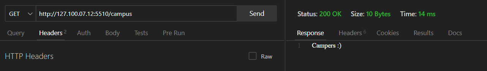
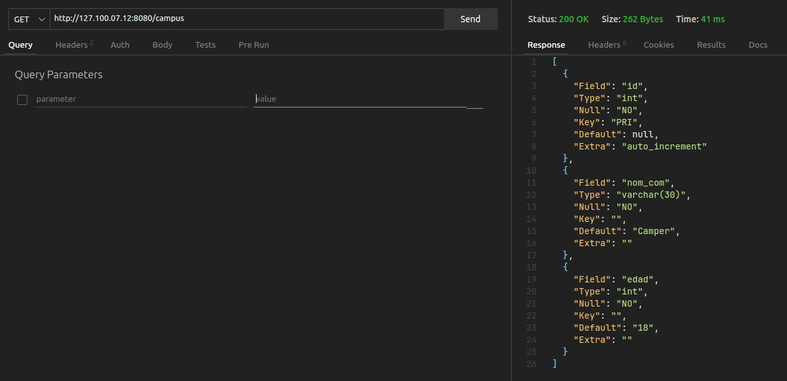
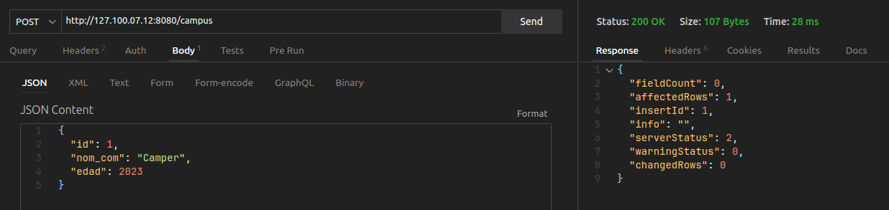
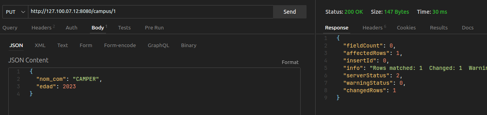
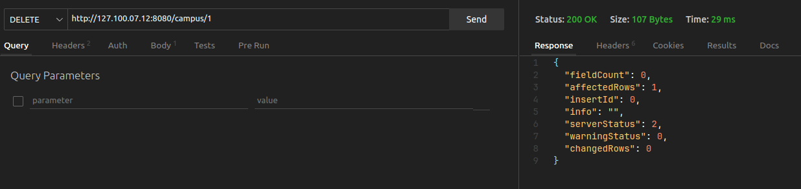
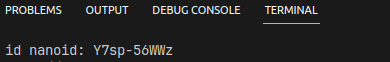

# Express

## Intalacion:
iniciamos el npm : `- npm init -y`
- `npm i -E -D nodemon`
- `npm i -E -D express`

1. el archivo package.json ya debe tener iniciado el nodemon en:
`"dev": "nodemon --quiet ./app.js"`

2. Debes importar express en un archivo app.js:
```js
import express from 'express';
```
3. Ahora vamos a iniciar el servidor Express y configuraremos una ruta llamada `/campus`.
```js
import express from 'express';

const expressApp = express();

expressApp.get('/campus', (req,res)=>{
    res.send("Hello Developer")
});

let config = {
    hostname: "127.100.07.12",
    port: 5510
}
expressApp.listen(config, ()=>{
    console.log(`http://${config.hostname}:${config.port}/campus`)
})
```
4. En la terminal debera poner el comando:
`- npm run dev`

## Parametros y encabezados

-  params : En Express, los params se refieren a los parámetros enviados a través del enrutador en una solicitud HTTP. Los parámetros son partes variables de la URL que permiten capturar valores específicos y utilizarlos en la lógica de la aplicación. En Express, los parámetros se definen en la ruta utilizando dos puntos (:) seguidos de un nombre de variable. Por ejemplo, en la ruta /campus/:idCamper, idCamper es un parámetro que puede tomar diferentes valores en cada solicitud.
- headers: En Express, los "headers" (encabezados) se refieren a la información adicional que se envía junto con una solicitud HTTP o una respuesta HTTP. Los encabezados proporcionan metadatos sobre la solicitud o respuesta, como el tipo de contenido, la codificación, las cookies, la autenticación y otros detalles importantes. En Express, los encabezados se pueden acceder y manipular utilizando el objeto req.headers para las solicitudes entrantes y el objeto res.set() o res.setHeader() para las respuestas salientes.

1. Peticion: 
```js
appExpress.get('/campus/:idCamper', (req, res) => {
    let obj = {
        "Datos de la url": req.params,
        "Encabezado": req.headers
    }
    res.send(JSON.stringify(obj))
})
```

## Middleware

Los middlewares pueden realizar diversas tareas, como modificar los objetos de solicitud y respuesta, realizar validaciones, autenticar usuarios, administrar sesiones, registrar información de registro, comprimir o cifrar datos, entre otros.

Ejemplo:
```js
appExpress.use(express.json());
appExpress.use(express.text());

appExpress.post('/campus/:nombre', (req, res) => {
    let obj = {
        data: req.body,
        'URL-GET': req.query,
        parametros: req.params
    };
    res.send(obj);
});
```
1. El middleware permite la entrada de datos json y text, y asi hacemos la peticion:


## Router

En Express, un router es una forma de organizar y gestionar las rutas de una aplicación web de manera modular. Los routers permiten agrupar rutas relacionadas y sus respectivos controladores en un lugar específico.
Un router en Express es un objeto que proporciona métodos para definir rutas y gestionar las solicitudes HTTP asociadas a esas rutas. Puedes utilizar varios routers en una aplicación Express para dividir y organizar las rutas en diferentes módulos o archivos.
- Sigue esta estructura:

Ejemplo de uso:
- campus.js:
```js
// campus.js
// Importamos el Router 
import { Router } from "express";

const appCamper = Router();

//Middleware
appCamper.use((req, res, next) => {
    console.log(req);
    next();
})

appCamper.get("/", (req, res) => {
    res.send("GET");
});

appCamper.get("/:id", (req, res) => {
    res.send(`GET: ${req.params.id}`);
});

appCamper.post("/", (req, res) => {
    res.send(`POST`);
})

//*Exportamos el Router
export default appCamper;
```
- app.js:
```js
// app.js
import express from "express";
//*Importamos el modulo que contiene los endpoints
import appCamper from "./routers/campus.js";
const appExpress = express();

appExpress.use(express.json());
appExpress.use("/campus", appCamper);

let config = {
    hostname: "127.100.07.12",
    port: 5510
}

appExpress.listen(config, () => {
    console.log(`http://${config.hostname}:${config.port}/campus`);
});
```
1. Utilizamos la ruta `/campus` y despues accedemos a `appCamper` donde hacemos el proceso de los endpoints


## Variables de entorno dotenv
Las variables de entorno en Node.js son variables específicas del entorno en el que se ejecuta una aplicación. Son valores que se pueden configurar externamente al código y se utilizan para almacenar información sensible, configuraciones personalizadas u otros datos relevantes para la aplicación.
En Node.js, las variables de entorno se pueden acceder utilizando el objeto process.env. Este objeto proporciona acceso a todas las variables de entorno definidas en el sistema operativo donde se está ejecutando la aplicación.

### Instalacion de dotenv

1. Se ejecuta el comando: `npm i -E -D dotenv`
2. Crea un archivo llamado .env en la raíz de tu proyecto y agrega las variables de entorno que deseas configurar. Por ejemplo:

```js
HOSTNAME = "127.100.07.12"
PORT = 5510
```
3. En el archivo donde desees utilizar las variables de entorno (por ejemplo, app.js), agrega las siguientes líneas al principio del archivo:
```js
//app.js
import dotenv from "dotenv";

dotenv.config();

console.log(process.env.HOSTNAME);
console.log(process.env.PORT);
```


4. Recuerda que el archivo .env debe mantenerse fuera del control de versiones, ya que generalmente contiene información sensible como claves de API o contraseñas. Sin embargo, puedes proporcionar un archivo .env.example que incluya las variables de entorno esperadas con valores de ejemplo para que otros desarrolladores puedan configurar su propio archivo .env.


### Configuracion de dotenv con express
```js
//.env
MY_CONFIG = {"hostname": "127.100.07.12", "port": 5510}
```
Esta línea de código carga las variable de entorno definidas en el archivo .env en process.env, lo que permite acceder a ellas posteriormente.
```js
//app.js
import express from "express";
import dotenv from "dotenv";
dotenv.config();
let appExpress = express();
/**
 * * Obtenemos la cadena de configuracion del servidor
 * ? y la parseamos a un objeto de js
 * @var {process.env.MY_CONFIG}
 */
let config = JSON.parse(process.env.MY_CONFIG);

appExpress.get('/campus', (req, res) => {
    res.send("Campers :)");
});

appExpress.listen(config, () => {
    console.log(`http://${config.hostname}:${config.port}`);
});
```
1. Se obtiene la configuración del servidor desde la variable de entorno MY_CONFIG, que se supone contiene una cadena JSON. La cadena se analiza y se convierte en un objeto JavaScript utilizando JSON.parse(), y se guarda en la variable config.



2. Se define una ruta GET para la ruta /campus. Cuando se accede a esta ruta, se envía la respuesta "Campers :)".

3. Ejemplo de el `.env.example`:
```js
MY_CONFIG = {}
```
## Conexión a MySQL usando 'mysql2'
mysql2 es un paquete de Node.js que proporciona una interfaz para interactuar con bases de datos MySQL. Es una biblioteca de cliente MySQL para Node.js que se basa en el paquete mysql original pero con varias mejoras y optimizaciones.
### Instalación de mysql2
1. Abre una terminal o línea de comandos y navega hasta la ubicación de tu proyecto.
2. Ejecuta el siguiente comando para instalar `npm i -E -D mysql2`:
3. Una vez finalizada la instalación, puedes comenzar a utilizar mysql2 en tu aplicación. Asegúrate de requerirlo en tu archivo de JavaScript donde necesites interactuar con la base de datos MySQL. Puedes hacerlo utilizando el siguiente código:
```js
import mysql from "mysql2";
```
4. Con esto, podrás utilizar las funciones y métodos proporcionados por mysql2 para conectarte y realizar consultas a tu base de datos MySQL.
Ejemplo práctico:
Para este ejemplo creamos la base de datos con estas configuraciones:
```sql
/*Creamos la base de datos*/
CREATE DATABASE db_campus;
/*La usamos*/
USE db_campus;
/*Creamos la tabla*/
CREATE TABLE tb_information(
    id INT(11) NOT NULL PRIMARY KEY AUTO_INCREMENT,
    nom_com VARCHAR(30) DEFAULT 'Camper' NOT NULL,
    edad INTEGER DEFAULT 18 NOT NULL
);
```
5. A continuación, se crea una conexión a la base de datos MySQL utilizando el método createPool del objeto mysql. Se proporcionan los detalles de conexión, como el host, usuario, contraseña y nombre de la base de datos:
```js
//.env
MY_DB = {"host": "localhost", "port": "3306", "user": "campus", "password": "campus2023", "database": "db_campus"}
```
```js
const con = mysql.createPool(JSON.parse(process.env.MY_DB));
```
Aquí, se crea un objeto de conexión con que se utilizará para realizar la consulta a la base de datos.
6. Luego, se realiza la consulta utilizando el método query del objeto de conexión. Se pasa la consulta SQL como una cadena y una función de devolución de llamada para manejar el resultado de la consulta:
```js
con.query(
    /*sql */`SHOW COLUMNS FROM db_campus.tb_information`,
    (err, data, fill) => {
        res.send(data);
    }
);
```
- En este caso, la consulta es SHOW COLUMNS FROM db_campus.tb_information, que muestra las columnas de la tabla tb_information en la base de datos db_campus. La función de devolución de llamada recibe tres parámetros: err para posibles errores, res para los resultados de la consulta y fie para los metadatos de los campos.
- En el código proporcionado, se imprime el resultado de la consulta en la consola utilizando console.log(res). Puedes comentar o eliminar los comentarios (//) si deseas ver también los posibles errores (err) y los metadatos de los campos (fie).

## SELECT
Ejemplo:
```js
/**
 * Buscar datos
 * @var {/:id}
 * * Parametro opcional si no lo envias por defecto buscara todos los datos
 */
appUser.get('/:id?', async (req, res) => {
    const con = mysql.createPool(JSON.parse(process.env.MY_DB));
    let sql = (req.params.id)
        ? [`SELECT * FROM tb_information WHERE ?`, req.params]
        : [`SELECT * FROM tb_information`];
    con.query(...sql,
        (err, data, fill) => {
            res.send(data);
        }
    );
})
```
## INSERT INTO
Ejemplo:
```js
/**
 * Insertar datos
 * @var {req.body}
 * * {
 * *    "id": 1,
 * *    "nom_com": "Camper",
 * *    "edad": 2023
 * * }
 */
appUser.post("/", async (req, res) => {
    con.query(
        /*sql */`INSERT INTO tb_information SET ?`,
        req.body,
        (err, data, fill) => {
            res.send(data);
        }
    )
})
```

## UPDATE
Ejemplo:
```js
/**
 * Actualizar datos
 * @var {req.body}
 * * {
 * *    "nom_com": "CAMPER",
 * *    "edad": 2023
 * * }
 * @var {req.params}
 * * {
 * *    "id": 1 
 * * }
 */
appUser.put("/:id", async (req, res) => {
    con.query(
        /*sql */`UPDATE tb_information SET ? WHERE id = ?`,
        [req.body, req.params.id],
        (err, data, fill) => {
            res.send(data);
        }
    )
})
```

## DELETE 
Ejemplo:
```js
/**
 * Eliminar datos
 * @var {req.params}
 * * {
 * *    "id": 1
 * * }
 */
appUser.delete("/:id", async (req, res) => {
    con.query(
        /*sql */`DELETE FROM tb_information WHERE ?`,
        req.params,
        (err, data, fill) => {
            res.send(data);
        }
    )
})
```

# nanoid
NanoID es una biblioteca de generación de identificadores únicos y aleatorios en Node.js. Proporciona una forma sencilla de generar identificadores únicos que pueden ser utilizados, por ejemplo, como claves primarias en bases de datos, identificadores de objetos, tokens de autenticación, entre otros casos de uso.
La biblioteca NanoID está diseñada para ser rápida, compacta y segura, generando identificadores únicos de forma eficiente. Utiliza una combinación de caracteres alfanuméricos y se puede configurar para generar identificadores con diferentes longitudes y utilizando diferentes alfabetos. https://github.com/ai/nanoid
## Instalacion
1. Abre una terminal o línea de comandos en el directorio raíz de tu proyecto
2. Ejecuta el siguiente comando para instalar nanoID a través de npm (Node Package Manager): `npm i -E -D nanoid`
3. Una vez que la instalación esté completa, puedes utilizar nanoID en tu proyecto de Node.js importándolo en tus archivos JavaScript. Por ejemplo, si quieres generar un nanoID en tu código, puedes hacer lo siguiente:
```js
//app.js
import { nanoid } from "nanoid"
/**
 * ? Genera un hast de 21 caracteres
 * @var {nanoid(10)} * Si deseamos mas o menos caracteres
 */
const id = nanoid(10);
console.log(id);
```
